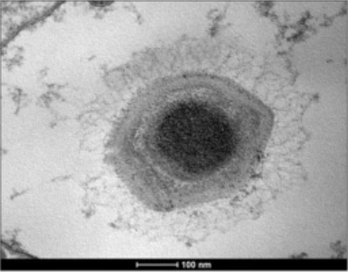
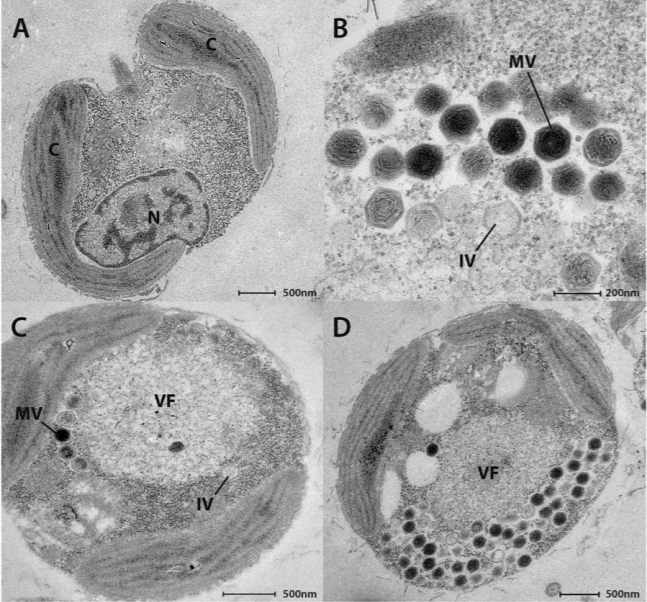

```{r setup, include=FALSE}
knitr::opts_chunk$set(echo = TRUE)
```

## Canarypox virus strain ATCC VR-111
#### *Poxviruses*
AY318871

https://www.ncbi.nlm.nih.gov/nuccore/AY318871

## Choristoneura biennis entomopoxvirus 'L'
#### *Poxviruses*
HF679132

https://www.ncbi.nlm.nih.gov/nuccore/HF679132

## Penguinpox virus isolate PSan92
#### *Poxviruses*
KJ859677

https://www.ncbi.nlm.nih.gov/nuccore/KJ859677

## Flamingopox virus FGPVKD09
#### *Poxviruses*
MF678796

https://www.ncbi.nlm.nih.gov/nuccore/MF678796

## Fowlpox virus
#### *Poxviruses*
AF198100

https://www.ncbi.nlm.nih.gov/nuccore/AF198100

## Choristoneura rosaceana entomopoxvirus 'L'
#### *Poxviruses*
HF679133

https://www.ncbi.nlm.nih.gov/nuccore/HF679133

## Pigeonpox virus isolate FeP2
#### *Poxviruses*
KJ801920

https://www.ncbi.nlm.nih.gov/nuccore/KJ801920

## Mythimna separata entomopoxvirus 'L'
#### *Poxviruses*
HF679134

https://www.ncbi.nlm.nih.gov/nuccore/HF679134

## Anomala cuprea entomopoxvirus DNA CV6M
#### *Poxviruses*
AP013055

https://www.ncbi.nlm.nih.gov/nuccore/AP013055

## Salmon gill poxvirus
#### *Poxviruses*
KT159937

https://www.ncbi.nlm.nih.gov/nuccore/KT159937

## Melanoplus sanguinipes entomopoxvirus 'O' isolate Tucson
#### *Poxviruses*
AF063866

https://www.ncbi.nlm.nih.gov/nuccore/AF063866

## Amsacta moorei entomopoxvirus
#### *Poxviruses*
AF250284

https://www.ncbi.nlm.nih.gov/nuccore/AF250284

## Adoxophyes honmai enomopoxvirus 'L'
#### *Poxviruses*
HF679131

https://www.ncbi.nlm.nih.gov/nuccore/HF679131

## Cowpox virus strain Brighton Red
#### *Poxviruses*
AF482758

https://www.ncbi.nlm.nih.gov/nuccore/AF482758

## Skunkpox virus strain WA
#### *Poxviruses*
KU749310

https://www.ncbi.nlm.nih.gov/nuccore/KU749310

## Volepox virus strain CA
#### *Poxviruses*
KU749311

https://www.ncbi.nlm.nih.gov/nuccore/KU749311

## Raccoonpox virus
#### *Poxviruses*
NC027213

https://www.ncbi.nlm.nih.gov/nuccore/NC027213

## Ectromelia virus strain Moscow
#### *Poxviruses*
AF012825

https://www.ncbi.nlm.nih.gov/nuccore/AF012825

## Camelpox virus CMS
#### *Poxviruses*
AY009089

https://www.ncbi.nlm.nih.gov/nuccore/AY009089

## Camelpox virus GVMAG-M-96 from Kazakhstan
#### *Poxviruses*
AF438165

https://www.ncbi.nlm.nih.gov/nuccore/AF438165

## Murmansk poxvirus strain LEIV-11411
#### *Poxviruses*
MF001304

https://www.ncbi.nlm.nih.gov/nuccore/MF001304

## NY_014 poxvirus strain 2013
#### *Poxviruses*
MF001305

https://www.ncbi.nlm.nih.gov/nuccore/MF001305

## Taterapox virus
#### *Poxviruses*
NC008291

https://www.ncbi.nlm.nih.gov/nuccore/NC008291

## Taterapox virus strain Dahomey 1968
#### *Poxviruses*
DQ437594

https://www.ncbi.nlm.nih.gov/nuccore/DQ437594

## Monkeypox virus strain Zaire-96-I-16
#### *Poxviruses*
AF380138

https://www.ncbi.nlm.nih.gov/nuccore/AF380138

## Vaccinia virus WR
#### *Poxviruses*
AY243312

https://www.ncbi.nlm.nih.gov/nuccore/AY243312

## Molluscum contagiosum virus subtype 1
#### *Poxviruses*
NC_001731

https://www.ncbi.nlm.nih.gov/nuccore/NC_001731

## Nile crocodilepox virus
#### *Poxviruses*
DQ356948

https://www.ncbi.nlm.nih.gov/nuccore/DQ356948

## Turkeypox virus strain TKPV-HU1124/2011
#### *Poxviruses*
KP728110

https://www.ncbi.nlm.nih.gov/nuccore/KP728110

## Variola virus DNA
#### *Poxviruses*
NC_001611

https://www.ncbi.nlm.nih.gov/nuccore/NC_001611

## Cotia virus SPAn232
#### *Poxviruses*
HQ647181

https://www.ncbi.nlm.nih.gov/nuccore/HQ647181

## Eptesipox virus strain Washington
#### *Poxviruses*
KY747497

https://www.ncbi.nlm.nih.gov/nuccore/KY747497

## Yoka poxvirus
#### *Poxviruses*
NC015960

https://www.ncbi.nlm.nih.gov/nuccore/NC015960

## Yoka poxvirus strain DakArB 4268
#### *Poxviruses*
HQ849551

https://www.ncbi.nlm.nih.gov/nuccore/HQ849551

## Deerpox virus W-1170-84
#### *Poxviruses*
AY841896

https://www.ncbi.nlm.nih.gov/nuccore/AY841896

## Deerpox virus W-848-83
#### *Poxviruses*
AY689436

https://www.ncbi.nlm.nih.gov/nuccore/AY689436

## BeAn 58058 virus
#### *Poxviruses*
KY094066

https://www.ncbi.nlm.nih.gov/nuccore/KY094066

## Myxoma virus strain Lausanne
#### *Poxviruses*
AF170726

https://www.ncbi.nlm.nih.gov/nuccore/AF170726

## Rabbit fibroma virus
#### *Poxviruses*
AF170722

https://www.ncbi.nlm.nih.gov/nuccore/AF170722

## Lumpy skin disease virus NI-2490 isolate Neethling 2490
#### *Poxviruses*
AF325528

https://www.ncbi.nlm.nih.gov/nuccore/AF325528

## Sheeppox virus 10700-99 strain TU-V02127
#### *Poxviruses*
AY077832

https://www.ncbi.nlm.nih.gov/nuccore/AY077832

## Goatpox virus Pellor
#### *Poxviruses*
AY077835

https://www.ncbi.nlm.nih.gov/nuccore/AY077835

## Squirrel poxvirus strain Red squirrel UK
#### *Poxviruses*
HE601899

https://www.ncbi.nlm.nih.gov/nuccore/HE601899

## Swinepox virus isolate 17077-99
#### *Poxviruses*
AF410153

https://www.ncbi.nlm.nih.gov/nuccore/AF410153

## Pseudocowpox virus strain VR634
#### *Poxviruses*
GQ329670

https://www.ncbi.nlm.nih.gov/nuccore/GQ329670

## Yaba-like disease virus (YLDV)
#### *Poxviruses*
AJ293568

https://www.ncbi.nlm.nih.gov/nuccore/AJ293568

## Squirrelpox virus Berlin_2015
#### *Poxviruses*
MF503315

https://www.ncbi.nlm.nih.gov/nuccore/MF503315

## Parapoxvirus red deer/HL953 strain HL953
#### *Poxviruses*
KM502564

https://www.ncbi.nlm.nih.gov/nuccore/KM502564

## Orf virus strain OV-SA00
#### *Poxviruses*
AY386264

https://www.ncbi.nlm.nih.gov/nuccore/AY386264

## Yaba monkey tumor virus
#### *Poxviruses*
AY386371

https://www.ncbi.nlm.nih.gov/nuccore/AY386371

## Bovine papular stomatitis virus strain BV-AR02
#### *Poxviruses*
AY386265

https://www.ncbi.nlm.nih.gov/nuccore/AY386265

## Pteropox virus strain Australia
#### *Poxviruses*
KU980965

https://www.ncbi.nlm.nih.gov/nuccore/KU980965

## Seal parapoxvirus isolate AFK76s1
#### *Poxviruses*
KY382358

https://www.ncbi.nlm.nih.gov/nuccore/KY382358

## Sea otter poxvirus strain ELK
#### *Poxviruses*
MH427217

https://www.ncbi.nlm.nih.gov/nuccore/MH427217

## African swine fever virus Georgia 20071
#### *Asfarviruses*
FR682468

https://www.ncbi.nlm.nih.gov/nuccore/FR682468

## African swine fever virus Malawi LIL 201
#### *Asfarviruses*
AY261361

https://www.ncbi.nlm.nih.gov/nuccore/AY261361

## African swine fever virus BA71V
#### *Asfarviruses*
NC001659

https://www.ncbi.nlm.nih.gov/nuccore/NC001659

## Faustovirus LC9
#### *Faustoviruses*
CZDJ02000001

https://www.ncbi.nlm.nih.gov/nuccore/CZDJ02000001

## Faustovirus E12
#### *Faustoviruses*
KJ614390

https://www.ncbi.nlm.nih.gov/nuccore/KJ614390

## Faustovirus D5A
#### *Faustoviruses*
KU702950

https://www.ncbi.nlm.nih.gov/nuccore/KU702950

## Faustovirus E24
#### *Faustoviruses*
KU702948

https://www.ncbi.nlm.nih.gov/nuccore/KU702948

## Faustovirus E23
#### *Faustoviruses*
KU702952

https://www.ncbi.nlm.nih.gov/nuccore/KU702952

## Faustovirus D5B
#### *Faustoviruses*
KU702949

https://www.ncbi.nlm.nih.gov/nuccore/KU702949

## Faustovirus D6
#### *Faustoviruses*
KU702951

https://www.ncbi.nlm.nih.gov/nuccore/KU702951

## Faustovirus D3
#### *Faustoviruses*
KU556803

https://www.ncbi.nlm.nih.gov/nuccore/KU556803

## Kaumoebavirus isolate Sc
#### *Kaumoebaviruses*
KX552040

https://www.ncbi.nlm.nih.gov/nuccore/KX552040

## Pacmanvirus A23
#### *Pacmanviruses*
NC_034383

https://www.ncbi.nlm.nih.gov/nuccore/NC_034383

## Aureococcus anophagefferens virus btv-01
#### *Aureococcusviruses*
NC024697

https://www.ncbi.nlm.nih.gov/nuccore/NC024697

## Tetraselmis virus 1
#### *Tetraselmisviruses*
KY322437

https://www.ncbi.nlm.nih.gov/nuccore/KY322437

## Heliothis virescens ascovirus 3g
#### *Ascoviruses*
JX491653

https://www.ncbi.nlm.nih.gov/nuccore/JX491653

## Heliothis virescens ascovirus 3f
#### *Ascoviruses*
KJ755191

https://www.ncbi.nlm.nih.gov/nuccore/KJ755191

## Heliothis virescens ascovirus 3e
#### *Ascoviruses*
NC009233

https://www.ncbi.nlm.nih.gov/nuccore/NC009233

## Trichoplusia ni ascovirus 6b
#### *Ascoviruses*
KY434117

https://www.ncbi.nlm.nih.gov/nuccore/KY434117

## Trichoplusia ni ascovirus 2c
#### *Ascoviruses*
NC_008518

https://www.ncbi.nlm.nih.gov/nuccore/NC_008518

## Cherax quadricarinatus iridovirus CQIV-CN01
#### *Ascoviruses*
MF197913

https://www.ncbi.nlm.nih.gov/nuccore/MF197913

## Spodoptera frugiperda ascovirus 1a
#### *Ascoviruses*
NC_008361

https://www.ncbi.nlm.nih.gov/nuccore/NC_008361

## Scale drop disease virus isolate C4575
#### *Ascoviruses*
NC_027778

https://www.ncbi.nlm.nih.gov/nuccore/NC_027778

## Diadromus pulchellus ascovirus 4a
#### *Ascoviruses*
NC_011335

https://www.ncbi.nlm.nih.gov/nuccore/NC_011335

## Ranavirus maximus isolate SMA15001
#### *Ascoviruses*
NC_030842

https://www.ncbi.nlm.nih.gov/nuccore/NC_030842

## Chinese giant salamander iridovirus CGSIV-HN1104
#### *Ascoviruses*
KF512820

https://www.ncbi.nlm.nih.gov/nuccore/KF512820

## A. vulgare iridescent virus 31
#### *Iridoviruses*
NC024451

https://www.ncbi.nlm.nih.gov/nuccore/NC024451

## Invertebrate iridescent virus 6
#### *Iridoviruses*
NC003038

https://www.ncbi.nlm.nih.gov/nuccore/NC003038

## Wiseana iridescent virus
#### *Iridoviruses*
NC015780

https://www.ncbi.nlm.nih.gov/nuccore/NC015780

## Invertebrate iridovirus 25
#### *Iridoviruses*
NC023613

https://www.ncbi.nlm.nih.gov/nuccore/NC023613

## Invertebrate iridovirus 30
#### *Iridoviruses*
NC023611

https://www.ncbi.nlm.nih.gov/nuccore/NC023611

## Invertebrate iridovirus 22
#### *Iridoviruses*
NC021901

https://www.ncbi.nlm.nih.gov/nuccore/NC021901

## Anopheles minimus irodovirus isolate AMIV
#### *Iridoviruses*
NC_023848

https://www.ncbi.nlm.nih.gov/nuccore/NC_023848

## Tunisvirus fontaine2 U484
#### *Marseilleviruses*
KF483846

https://www.ncbi.nlm.nih.gov/nuccore/KF483846

## Noumeavirus NMV1
#### *Marseilleviruses*
NC033775

https://www.ncbi.nlm.nih.gov/nuccore/NC033775

## Tokyovirus A1
#### *Marseilleviruses*
NC030230

https://www.ncbi.nlm.nih.gov/nuccore/NC030230

## Melbournevirus
#### *Marseilleviruses*
NC025412

https://www.ncbi.nlm.nih.gov/nuccore/NC025412

## Marseillevirus marseillevirus t19
#### *Marseilleviruses*
NC013756

https://www.ncbi.nlm.nih.gov/nuccore/NC013756

## Brazilian marseillevirus BH2014
#### *Marseilleviruses*
NC029692

https://www.ncbi.nlm.nih.gov/nuccore/NC029692

## Golden Marseillevirus
#### *Marseilleviruses*
NC_031465

https://www.ncbi.nlm.nih.gov/nuccore/NC_031465

## Port-miou virus
#### *Marseilleviruses*
KT428292

https://www.ncbi.nlm.nih.gov/nuccore/KT428292

## Lausannevirus
#### *Marseilleviruses*
NC015326

https://www.ncbi.nlm.nih.gov/nuccore/NC015326

## Orpheovirus IHUMI-LCC2
#### *Orpheoviruses*
NC_036594

https://www.ncbi.nlm.nih.gov/nuccore/NC_036594

## Pithovirus LC8
#### *Pithocedratviruses*
LT598839

https://www.ncbi.nlm.nih.gov/nuccore/LT598839

## Pithovirus sibericum p1084-t
#### *Pithocedratviruses*
NC023423

https://www.ncbi.nlm.nih.gov/nuccore/NC023423

## Cedratvirus A11
#### *Pithocedratviruses*
NC_032108

https://www.ncbi.nlm.nih.gov/nuccore/NC_032108

## Cedratvirus lausannensis
#### *Pithocedratviruses*
LT907979

https://www.ncbi.nlm.nih.gov/nuccore/LT907979

## Cedratvirus Zaza IHUMI-S29
#### *Pithocedratviruses*
LT994652

https://www.ncbi.nlm.nih.gov/nuccore/LT994652

## Brazilian cedratvirus IHUMI-27.7
#### *Pithocedratviruses*
LT994651

https://www.ncbi.nlm.nih.gov/nuccore/LT994651

## P. bursaria Chlorella virus NY2A
#### *Chloroviruses*
NC009898

https://www.ncbi.nlm.nih.gov/nuccore/NC009898

## P. bursaria chlorella virus ar158
#### *Chloroviruses*
NC009899

https://www.ncbi.nlm.nih.gov/nuccore/NC009899

## P. bursaria Chlorella virus MA-1D
#### *Chloroviruses*
JX997172

https://www.ncbi.nlm.nih.gov/nuccore/JX997172

## P. bursaria chlorella virus 1
#### *Chloroviruses*
NC000852

https://www.ncbi.nlm.nih.gov/nuccore/NC000852

## P. bursaria Chlorella virus CVR-1
#### *Chloroviruses*
JX997164

https://www.ncbi.nlm.nih.gov/nuccore/JX997164

## A. turfacea Chlorella virus OR0704
#### *Chloroviruses*
JX997185

https://www.ncbi.nlm.nih.gov/nuccore/JX997185

## A. turfacea Chlorella virus MO0605SPH
#### *Chloroviruses*
JX997175

https://www.ncbi.nlm.nih.gov/nuccore/JX997175

## A. turfacea Chlorella virus WI0606
#### *Chloroviruses*
JX997187

https://www.ncbi.nlm.nih.gov/nuccore/JX997187

## A. polyphaga moumouvirus
#### *Chloroviruses*
NC020104

https://www.ncbi.nlm.nih.gov/nuccore/NC020104

## E. huxleyi virus 208
#### *Coccolithoviruses*
JF974318

https://www.ncbi.nlm.nih.gov/nuccore/JF974318

## E. huxleyi virus 86
#### *Coccolithoviruses*
NC007346

https://www.ncbi.nlm.nih.gov/nuccore/NC007346

## E. huxleyi virus 201
#### *Coccolithoviruses*
JF974311

https://www.ncbi.nlm.nih.gov/nuccore/JF974311

## Acanthamoeba castellanii medusavirus
#### *Medusaviruses*
AP018495

https://www.ncbi.nlm.nih.gov/nuccore/AP018495

## Mollivirus sibericum p1084t
#### *Molliviruses*
NC027867

https://www.ncbi.nlm.nih.gov/nuccore/NC027867

## Pandoravirus salinus
#### *Pandoraviruses*
NC022098

https://www.ncbi.nlm.nih.gov/nuccore/NC022098

## Pandoravirus inopinatum isolate KlaHel
#### *Pandoraviruses*
NC026440

https://www.ncbi.nlm.nih.gov/nuccore/NC026440

## Pandoravirus quercus
#### *Pandoraviruses*
MG011689

https://www.ncbi.nlm.nih.gov/nuccore/MG011689

## Pandoravirus neocaledonia
#### *Pandoraviruses*
MG011690

https://www.ncbi.nlm.nih.gov/nuccore/MG011690

## Pandoravirus dulcis
#### *Pandoraviruses*
NC021858

https://www.ncbi.nlm.nih.gov/nuccore/NC021858

## Pandoravirus macleodensis
#### *Pandoraviruses*
MG011691

https://www.ncbi.nlm.nih.gov/nuccore/MG011691

## Pandoravirus braziliensis SL2
#### *Pandoraviruses*
LT972217

https://www.ncbi.nlm.nih.gov/nuccore/LT972217

## Pandoravirus pampulha
#### *Pandoraviruses*
OFAJ01000001

https://www.ncbi.nlm.nih.gov/nuccore/OFAJ01000001

## Pandoravirus massiliensis BZ81
#### *Pandoraviruses*
OFAI01000001

https://www.ncbi.nlm.nih.gov/nuccore/OFAI01000001

## Ectocarpus siliculosus virus 1
#### *Phaeoviruses*
NC002687

https://www.ncbi.nlm.nih.gov/nuccore/NC002687

## Feldmannia irregularis virus a
#### *Phaeoviruses*
NC_043254

https://www.ncbi.nlm.nih.gov/nuccore/NC_043254

## Feldmannia species virus
#### *Phaeoviruses*
NC011183

https://www.ncbi.nlm.nih.gov/nuccore/NC011183

## Bathycoccus sp. rcc1105 virus bpv1
#### *Prasinoviruses*
NC014765

https://www.ncbi.nlm.nih.gov/nuccore/NC014765

## O. lucimarinus virus 2 olv2
#### *Prasinoviruses*
NC028091

https://www.ncbi.nlm.nih.gov/nuccore/NC028091

## O. lucimarinus virus olv1
#### *Prasinoviruses*
NC014766

https://www.ncbi.nlm.nih.gov/nuccore/NC014766

## O. mediterraneus virus 1 omv1
#### *Prasinoviruses*
NC028092

https://www.ncbi.nlm.nih.gov/nuccore/NC028092

## O. tauri virus 1
#### *Prasinoviruses*
NC013288

https://www.ncbi.nlm.nih.gov/nuccore/NC013288

## O. tauri virus otv5
#### *Prasinoviruses*
NC010191

https://www.ncbi.nlm.nih.gov/nuccore/NC010191

## O. lucimarinus virus OlV5
#### *Prasinoviruses*
HQ632827

https://www.ncbi.nlm.nih.gov/nuccore/HQ632827

## O. tauri virus 2
#### *Prasinoviruses*
NC014789

https://www.ncbi.nlm.nih.gov/nuccore/NC014789

## Micromonas sp. rcc1109 virus mpv1
#### *Prasinoviruses*
NC014767

https://www.ncbi.nlm.nih.gov/nuccore/NC014767

## O. lucimarinus virus 7 olv7
#### *Prasinoviruses*
NC028093

https://www.ncbi.nlm.nih.gov/nuccore/NC028093

## Heterosigma akashiwo virus 01
#### *Raphidoviruses*
NC_038553

https://www.ncbi.nlm.nih.gov/nuccore/NC_038553

## Cafeteria roenbergensis virus bv-pw1
#### *Cafeteriaviruses*
NC014637

https://www.ncbi.nlm.nih.gov/nuccore/NC014637

## Bodo saltans virus NG
#### *Klosneuviruses*
MF782455

https://www.ncbi.nlm.nih.gov/nuccore/MF782455

## Tupavirus Deep Ocean
#### *Megamimiviruses*
MF405918

https://www.ncbi.nlm.nih.gov/nuccore/MF405918

## Tupavirus Soda Lake
#### *Megamimiviruses*
KY523104

https://www.ncbi.nlm.nih.gov/nuccore/KY523104

## Niemeyer virus
#### *Megamimiviruses*
KT599914

https://www.ncbi.nlm.nih.gov/nuccore/KT599914

## Megavirus chiliensis
#### *Megamimiviruses*
NC016072

https://www.ncbi.nlm.nih.gov/nuccore/NC016072

## Megavirus shan
#### *Megamimiviruses*
LN868520

https://www.ncbi.nlm.nih.gov/nuccore/LN868520

## Megavirus courdo11
#### *Megamimiviruses*
JX975216

https://www.ncbi.nlm.nih.gov/nuccore/JX975216

## Megavirus terra1
#### *Megamimiviruses*
KF527229

https://www.ncbi.nlm.nih.gov/nuccore/KF527229

## Megavirus montpellier3
#### *Megamimiviruses*
LN868518

https://www.ncbi.nlm.nih.gov/nuccore/LN868518

## Megavirus vitis isolate vigne
#### *Megamimiviruses*
MG807319

https://www.ncbi.nlm.nih.gov/nuccore/MG807319

## Afrovirus Urmite69 
#### *Megamimiviruses*
CWHP01000001

www.ncbi.nlm.nih.gov/nuccore/CWHP01000001

## Bandra megavirus isolate KK-1
#### *Megamimiviruses*
MG779410

https://www.ncbi.nlm.nih.gov/nuccore/MG779410

## Megavirus lba
#### *Megamimiviruses*
JX885207

https://www.ncbi.nlm.nih.gov/nuccore/JX885207

## Megavirus bus
#### *Megamimiviruses*
LN868539

https://www.ncbi.nlm.nih.gov/nuccore/LN868539

## Megavirus battle43
#### *Megamimiviruses*
LN868256

https://www.ncbi.nlm.nih.gov/nuccore/LN868256

## Acanthamoeba polyphaga mimivirus Kroon
#### *Megamimiviruses*
KM982402

https://www.ncbi.nlm.nih.gov/nuccore/KM982402

## Megavirus T1
#### *Megamimiviruses*
LN868526

https://www.ncbi.nlm.nih.gov/nuccore/LN868526

## Megavirus avenue9
#### *Megamimiviruses*
LN867403

https://www.ncbi.nlm.nih.gov/nuccore/LN867403

## Acanthamoeba polyphaga mimivirus Oyster
#### *Megamimiviruses*
KM982401

https://www.ncbi.nlm.nih.gov/nuccore/KM982401

## Acanthamoeba polyphaga lentillevirus
#### *Megamimiviruses*
AFYC01000000

www.ncbi.nlm.nih.gov/nuccore/AFYC01000000

## A. castellanii mamavirus
#### *Megamimiviruses*
JF801956

https://www.ncbi.nlm.nih.gov/nuccore/JF801956

## Acanthamoeba castellanii mimivirus shirakomae
#### *Megamimiviruses*
AP017645

https://www.ncbi.nlm.nih.gov/nuccore/AP017645

## Acanthamoeba castellanii mimivirus kasaii
#### *Megamimiviruses*
AP017644

https://www.ncbi.nlm.nih.gov/nuccore/AP017644

## Mimivirus Bombay 1
#### *Megamimiviruses*
KU761889

https://www.ncbi.nlm.nih.gov/nuccore/KU761889

## A. polyphaga mimivirus
#### *Megamimiviruses*
NC014649

https://www.ncbi.nlm.nih.gov/nuccore/NC014649


## Samba virus
#### *Megamimiviruses*
KF959826

https://www.ncbi.nlm.nih.gov/nuccore/KF959826



## Hirudovirus Sangsue
#### *Megamimiviruses*
KF493731

https://www.ncbi.nlm.nih.gov/nuccore/KF493731


## Mimivirus amazonia
#### *Megamimiviruses*
LN867402

https://www.ncbi.nlm.nih.gov/nuccore/LN867402

## Mimivirus terra2
#### *Megamimiviruses*
NC023639

https://www.ncbi.nlm.nih.gov/nuccore/NC023639

## Mimivirus pointerouge1
#### *Megamimiviruses*
LN871174

https://www.ncbi.nlm.nih.gov/nuccore/LN871174

## Mimivirus longchamps
#### *Megamimiviruses*
LN871173

https://www.ncbi.nlm.nih.gov/nuccore/LN871173

## Saudi moumouvirus
#### *Megamimiviruses*
KY110734

https://www.ncbi.nlm.nih.gov/nuccore/KY110734


## Moumouvirus goulette
#### *Megamimiviruses*
KC008572

https://www.ncbi.nlm.nih.gov/nuccore/KC008572

## Moumouvirus Monve
#### *Megamimiviruses*
JN885998

https://www.ncbi.nlm.nih.gov/nuccore/JN885998

## Megavirus T4
#### *Megamimiviruses*
LN869537

https://www.ncbi.nlm.nih.gov/nuccore/LN869537

## Namao virus
#### *Namaoviruses*
MG745875

https://www.ncbi.nlm.nih.gov/nuccore/MG745875


## Chrysochromulina ericina virus cev-01b
#### *Chrysomulinaviruses*
NC028094

https://www.ncbi.nlm.nih.gov/nuccore/NC028094


## P. globosa virus 12T
#### *Prymnesioviruses*
HQ634147

https://www.ncbi.nlm.nih.gov/nuccore/HQ634147


## P. globosa virus 16T
#### *Prymnesioviruses*
KC662249

https://www.ncbi.nlm.nih.gov/nuccore/KC662249



